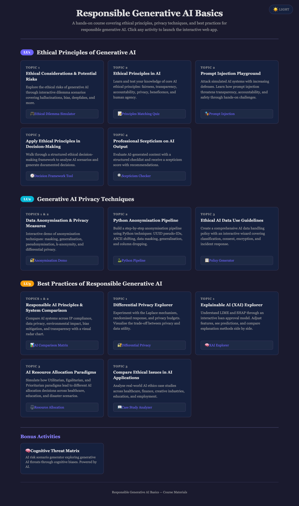

<div align="center">

# Responsible Generative AI Basics

[](https://developer.mozilla.org/en-US/docs/Web/HTML)
[](https://developer.mozilla.org/en-US/docs/Web/CSS)
[](https://developer.mozilla.org/en-US/docs/Web/JavaScript)
[](https://ai.google.dev/)
[](https://alfredang.github.io/TGS-2025060472--AI-Ethics/)

**A hands-on interactive course covering ethical principles, privacy techniques, and best practices for responsible generative AI.**

Activities for the WSQ course [Responsible Generative AI Basics (TGS-2025060472)](https://www.tertiarycourses.com.sg/wsq-responsible-generative-ai-basics.html).

[Live Demo](https://alfredang.github.io/TGS-2025060472--AI-Ethics/) · [Report Bug](https://github.com/alfredang/TGS-2025060472--AI-Ethics/issues) · [Request Feature](https://github.com/alfredang/TGS-2025060472--AI-Ethics/issues)

</div>

## Screenshot



## About

This repository contains the activities for the WSQ course **[Responsible Generative AI Basics (TGS-2025060472)](https://www.tertiarycourses.com.sg/wsq-responsible-generative-ai-basics.html)**, providing a foundational understanding of responsible generative AI practices through **14 interactive web-based activities** across three Learning Units. Learners explore ethical principles, privacy techniques, and best practices for developing and deploying generative AI systems responsibly.

### Key Features

- **14 interactive activities** — hands-on simulators, quizzes, explorers, and case study tools
- **Dark/Light theme** toggle across all activities
- **No installation required** — runs entirely in the browser
- **AI-powered demos** using Google Gemini API for data anonymisation simulations
- **Covers real-world topics** — prompt injection, differential privacy, XAI (LIME/SHAP), resource allocation ethics

## Course Activities

### LU1: Ethical Principles of Generative AI

| Activity | Description | Link |
|----------|-------------|------|
| Ethical Dilemma Simulator | Realistic AI ethical dilemma scenarios across healthcare, hiring, journalism, and education | [Launch](https://alfredang.github.io/TGS-2025060472--AI-Ethics/lu1-ethical-principles/ethical-dilemma/) |
| AI Principles Matching Quiz | Match ethical principles to definitions, examples, and violation scenarios | [Launch](https://alfredang.github.io/TGS-2025060472--AI-Ethics/lu1-ethical-principles/principles-quiz/) |
| Prompt Injection Playground | Attack simulated AI systems with 3 levels of increasing defences | [Launch](https://alfredang.github.io/TGS-2025060472--AI-Ethics/lu1-ethical-principles/prompt-injection/) |
| Decision Framework Tool | Step-by-step ethical decision-making framework for AI scenarios | [Launch](https://alfredang.github.io/TGS-2025060472--AI-Ethics/lu1-ethical-principles/decision-framework/) |
| Scepticism Checker | Evaluate AI-generated content with a structured checklist and scepticism score | [Launch](https://alfredang.github.io/TGS-2025060472--AI-Ethics/lu1-ethical-principles/skepticism-checker/) |
| Cognitive Threat Matrix | AI risk scenario generator exploring generative AI threats through cognitive biases (Gemini-powered) | [Launch](https://alfredang.github.io/TGS-2025060472--AI-Ethics/lu1-ethical-principles/cognitive-threat-matrix/) |

### LU2: Generative AI Privacy Techniques

| Activity | Description | Link |
|----------|-------------|------|
| Data Anonymisation Demo | Interactive demo of anonymisation techniques powered by Google Gemini API | [Launch](https://alfredang.github.io/TGS-2025060472--AI-Ethics/lu2-privacy/dataprivacy/) |
| Python Anonymisation Pipeline | Build a step-by-step anonymisation pipeline using Python techniques | [Launch](https://alfredang.github.io/TGS-2025060472--AI-Ethics/lu2-privacy/anonymizer-python/) |
| Privacy Policy Generator | Create a comprehensive AI data handling policy with an interactive wizard | [Launch](https://alfredang.github.io/TGS-2025060472--AI-Ethics/lu2-privacy/privacy-policy/) |

### LU3: Best Practices of Responsible Generative AI

| Activity | Description | Link |
|----------|-------------|------|
| AI Comparison Matrix | Compare AI systems across IP compliance, privacy, environmental impact with radar charts | [Launch](https://alfredang.github.io/TGS-2025060472--AI-Ethics/lu3-best-practices/ai-comparison/) |
| Differential Privacy Explorer | Experiment with Laplace mechanism, randomised response, and privacy budgets | [Launch](https://alfredang.github.io/TGS-2025060472--AI-Ethics/lu3-best-practices/differential-privacy/) |
| Explainable AI (XAI) Explorer | Understand LIME and SHAP through an interactive loan approval model | [Launch](https://alfredang.github.io/TGS-2025060472--AI-Ethics/lu3-best-practices/xai-explorer/) |
| AI Resource Allocation Simulator | Simulate Utilitarian, Egalitarian, and Prioritarian allocation paradigms | [Launch](https://alfredang.github.io/TGS-2025060472--AI-Ethics/lu3-best-practices/ai-resource-allocation/) |
| Ethics Case Study Analyzer | Analyse real-world AI ethics case studies across multiple domains | [Launch](https://alfredang.github.io/TGS-2025060472--AI-Ethics/lu3-best-practices/ethics-case-study/) |

## Tech Stack

| Layer | Technology |
|-------|-----------|
| Frontend | HTML5, CSS3, Vanilla JavaScript |
| AI Integration | Google Gemini API (gemini-2.0-flash) |
| Theming | CSS Custom Properties (dark/light) |
| Deployment | GitHub Pages |
| Typography | Georgia / Times New Roman serif stack |

## Architecture

```
┌─────────────────────────────────────────────┐
│              GitHub Pages (CDN)              │
├─────────────────────────────────────────────┤
│             index.html (root)               │
│           (Course Hub - Main Page)          │
├──────────┬──────────┬───────────────────────┤
│   LU1    │   LU2    │         LU3           │
│ Ethical  │ Privacy  │    Best Practices     │
│Principles│Techniques│                       │
├──────────┼──────────┼───────────────────────┤
│ 6 apps   │ 3 apps   │       5 apps          │
└──────────┴────┬─────┴───────────────────────┘
                │
        ┌───────▼────────┐
        │  Gemini API    │
        │ (client-side)  │
        └────────────────┘
```

## Project Structure

```
TGS-2025060472--AI-Ethics/
├── index.html                    # Course Hub (main landing page)
├── lu1-ethical-principles/       # Learning Unit 1
│   ├── ethical-dilemma/
│   ├── principles-quiz/
│   ├── prompt-injection/
│   ├── decision-framework/
│   ├── skepticism-checker/
│   └── cognitive-threat-matrix/  # Uses Gemini API
├── lu2-privacy/                  # Learning Unit 2
│   ├── dataprivacy/              # Uses Gemini API
│   ├── anonymizer-python/
│   └── privacy-policy/
├── lu3-best-practices/           # Learning Unit 3
│   ├── ai-comparison/
│   ├── differential-privacy/
│   ├── xai-explorer/
│   ├── ai-resource-allocation/
│   └── ethics-case-study/
├── course_activities.md          # Full course content & learning objectives
└── CLAUDE.md                    # AI assistant guidance
```

## Getting Started

No build step or installation required. All activities run directly in the browser.

**Option 1: Live Demo**

Visit the [Course Hub](https://alfredang.github.io/TGS-2025060472--AI-Ethics/)

**Option 2: Run Locally**

```bash
git clone https://github.com/alfredang/TGS-2025060472--AI-Ethics.git
cd TGS-2025060472--AI-Ethics
python3 -m http.server 8000
```

Then open `http://localhost:8000` in your browser.

> **Note:** The Data Anonymisation Demo and Cognitive Threat Matrix require a [Google Gemini API key](https://aistudio.google.com/apikey) entered at runtime.

## Contributing

1. Fork the repository
2. Create your feature branch (`git checkout -b feature/new-activity`)
3. Commit your changes (`git commit -m 'Add new activity'`)
4. Push to the branch (`git push origin feature/new-activity`)
5. Open a Pull Request

## Developed By

**Tertiary Infotech Academy Pte. Ltd.**

## Acknowledgements

- [Google Gemini API](https://ai.google.dev/) for AI-powered data generation
- [GitHub Pages](https://pages.github.com/) for hosting
- Course framework aligned with Singapore's AI Governance Framework and EU AI Act

---

<div align="center">

If you find this course useful, please give it a star!

</div>
